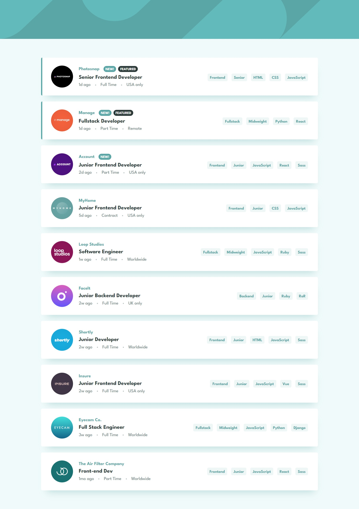

# Frontend Mentor - Job listings with filtering solution

This is a solution to the [Job listings with filtering challenge on Frontend Mentor](https://www.frontendmentor.io/challenges/job-listings-with-filtering-ivstIPCt). Frontend Mentor challenges help you improve your coding skills by building realistic projects.

## Table of contents

- [Overview](#overview)
  - [The challenge](#the-challenge)
  - [Screenshot](#screenshot)
  - [Links](#links)
- [My process](#my-process)
  - [Built with](#built-with)
  - [Useful resources](#useful-resources)
- [Author](#author)

## Overview

### The challenge

Users should be able to:

- View the optimal layout for the site depending on their device's screen size
- See hover states for all interactive elements on the page
- Filter job listings based on the categories

### Screenshot

### Links

- Solution URL: [https://www.frontendmentor.io/solutions/job-listings-with-filtering-using-react-dFBbPTF3zO](https://www.frontendmentor.io/solutions/job-listings-with-filtering-using-react-dFBbPTF3zO)
- Live Site URL: [https://am-job-listings-with-filtering.netlify.app/](https://am-job-listings-with-filtering.netlify.app/)

## My process

### Built with

- [Vite](https://vitejs.dev/)
- [React](https://reactjs.org/)
- [Typescript](https://www.typescriptlang.org/)
- [Tailwind CSS](https://tailwindcss.com/)
- [Sass](https://sass-lang.com/)

### Useful resources

- [EightShapes Text Crop Tool](https://text-crop.eightshapes.com/) - This tool was used to remove some of the unwanted white space found when using the League Spartan font from [Google Fonts](https://fonts.google.com/specimen/League+Spartan).

## Author

- Website - [Antonio Mercado](https://amdev.work)
- Frontend Mentor - [@antmercado94](https://www.frontendmentor.io/profile/antmercado94)
- Twitter - [@FirstFoodShop](https://www.twitter.com/firstfoodshop)
